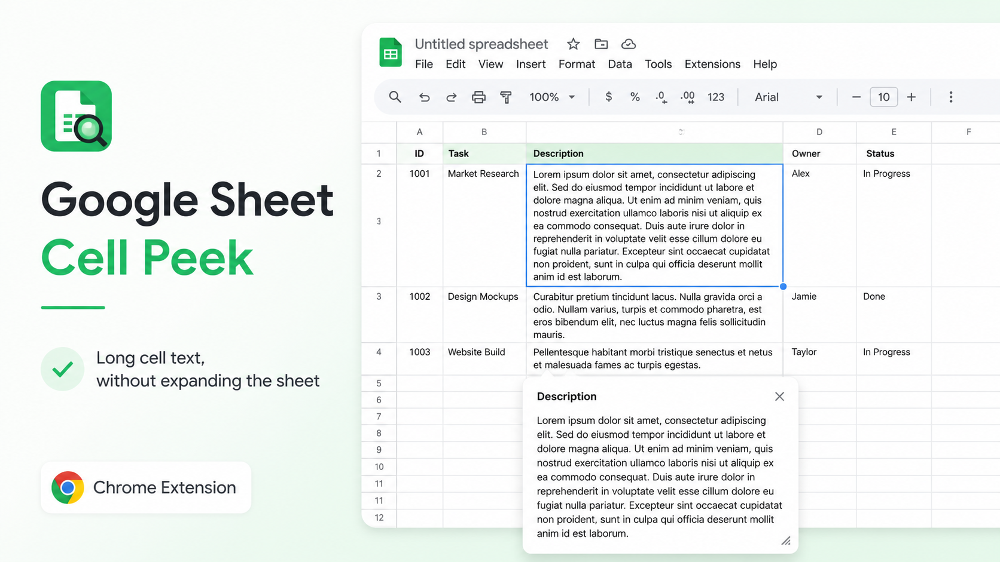

# Main post

Google Sheets 裡的儲存格如果放了很多文字，閱讀真的很痛苦。

欄寬不想拉大、列高不想變高，但又要看完整內容？

我做了一個 Chrome 外掛：

Google Sheet Cell Peek

目前可以：

- 點擊儲存格後顯示完整內容
- 一鍵 Copy
- 調整預覽文字大小
- 計算 Half-width 字數
- 直接 Edit／Save 回儲存格
- 懸浮視窗可以拖曳與關閉

目前是 Experimental MVP，先放出來看看這個功能是否也能幫助其他 Google Sheets 使用者。

歡迎試用、回報問題或提出你想要的功能：

https://github.com/bddgtw-tw/google_sheet_cell_peek

如果你常在 Google Sheets 裡處理很長的文案、商品描述或備註，歡迎留言告訴我你的使用情境。

#GoogleSheets #ChromeExtension #OpenSource #BuildInPublic #Productivity

## Suggested image

